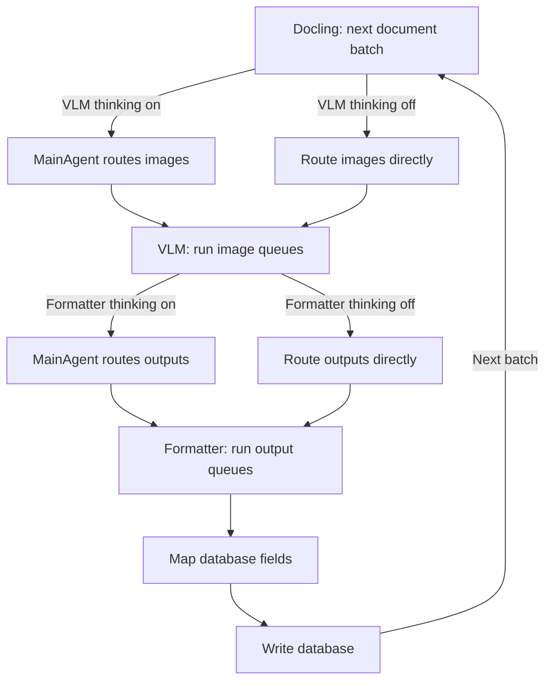

# MainAgent pipeline

The Studio graph follows the actual processing stages in
[src/agent/graph.py](src/agent/graph.py). Its exported definition is
[architecture/main_agent_graph.mmd](architecture/main_agent_graph.mmd).



## Setup and MainAgent decisions

The graph loads the approved run configuration and schema from the database,
checks current hardware, and builds the MainAgent system prompt. Named setup
nodes establish the routing maps, Redis queues, model resource plan and Docling
producer. Each setup operation has an expandable MainAgent/tool subgraph:
the selected call and its execution are separate checkpointable steps.
Each step accepts only its own named tool, even if another setup tool's
prerequisites also happen to be satisfied.

The current MainAgent is the installed `qwen3-abliterated:latest`, Ollama ID
`b07c3bcda724`. Local metadata reports Qwen3 architecture, 8.2B parameters,
Q4_K_M and native tools. This is the installed model the user called
`qwen3.8-abliterated`. Its reported 40,960-token model context is not an Ollama
allocation setting; the endpoint must allocate enough context for the run schema
and tool definitions.

There are three VLMs and three formatters, with both thinking flags enabled.
See [additional models](configuration/additional-models.md) for aliases, context
settings and the unverified under-4-GB RAM requirement for the two added VLMs.

When VLM thinking is enabled, queues exist for every configured VLM and default
formatter mappings cover every VLM that routing can choose. When formatter
thinking is enabled, every configured formatter has a queue. Default mappings
are starting choices, not restrictions on per-image reasoning.

Single-model stages route directly. The two thinking flags operate independently.
An explicit `main_agent=None` runs setup deterministically and requires direct
routing. The processing stages remain visible in either mode.

## Processing stages

Only the Docling producer and ownership lease run in the background.
[src/agent/stages.py](src/agent/stages.py) contains the named graph nodes;
[src/agent/stage_runtime.py](src/agent/stage_runtime.py) implements their queue
and persistence operations. The active graph has no `coordinate_pipeline`,
`dispatch_action` or general worker-event dispatch loop.

1. **start_docling** starts extraction and the run lease.
2. **docling** waits for the initial manifest minimum, or a smaller final input,
   then returns a bounded document batch.
3. **main_agent_route_images** asks for one native `select_vlm_queue` call per
   image, using caption, mentions, nearby text and the top three classifications.
   **route_images_directly** uses the configured mapping without an LLM call.
4. **vlm** enqueues that batch and runs the actual VLM requests, model groups and
   retries. The node finishes after the batch's VLM work has settled.
5. **main_agent_route_outputs** reads each saved VLM result and requests a native
   `select_formatter_queue` decision.
   **route_outputs_directly** applies the formatter mapping without an LLM call.
6. **formatter** runs the actual formatter requests and retries using the run's
   approved schema.
7. **map_database_fields** validates and saves the relational field mapping.
8. **write_database** releases settled documents from the extraction buffer and
   commits eligible whole-document SQL batches.
9. The graph returns to **docling** for another batch. An empty final batch goes
   directly to **write_database** to flush the tail, then **finish_run** records
   the outcome and closes owned resources.

Docling can continue filling the buffer during downstream work. VLM and formatter
stages execute sequentially for each batch; compatible models within a stage
can run concurrently. This provides visible stage boundaries and batches work
to limit model switching.

The default initial minimum is 20 documents and the maximum active buffer is
50. The local fixture uses a minimum of 1. After the initial gate opens, later
batches can start with any ready documents. Mapped documents waiting for a SQL
batch no longer occupy the extraction buffer.

## Queues, resources and failures

Redis queues are scoped by run, stage and model. Only a model's own consumers
read its queue. Requests per model and model-batch turns remain bounded.
Workers first recover their pending jobs. Saved results and routing decisions
are reused after interruption instead of repeating successful inference.

MainAgent proposes model groups and their order. Python requires exact queue
coverage and validates managed-model RAM/VRAM budgets, subtracting the configured
reserve. Capacity is checked again before managed groups launch.
`serving="managed"` uses the configured argument-list launch command and stops
only owned process groups. `serving="external"`, including the local Ollama
models, delegates actual memory allocation, loading and offload to that server.
The shared Ollama endpoint does not enforce a per-model 4 GB RAM cap.

VLM output is free-form. Formatters produce schema-validated data and
`unmapped_observations`. Chat and NuExtract adapters remain available; NuExtract
supports the schema subset documented in [schemas/README.md](schemas/README.md).

The retry limit counts additional attempts independently for VLM and formatting.
A formatter retry reuses saved VLM output. Workers retain raw output, invalid
responses and failure evidence in Redis. Routing rejects unavailable models and
allows at most three attempts to correct invalid native tool decisions.

With `approve_with_fails=False`, a terminal image failure blocks its document's
SQL write. With `"omit"`, failed image identities are stored with empty fields
alongside successful images. No invented measurements are inserted.

The writer commits at the configured document batch size, capped at 50; the
local fixture uses 1. It flushes a smaller tail only after production and upstream
processing finish. SQL writes are atomic per document and replay is idempotent.
Each image's graph state exposes `vlm_model` and `formatter_model`, so Studio
shows the selected routes alongside its result references and processing stage.
Progress reflects actual saved results and confirmed writes. Fatal exceptions
stop at their named graph stage and leave the run incomplete for recovery.

## Running and recovery

Complete [configuration/README.md](configuration/README.md), configure
`DATABASE_URL`, `REDIS_URL` and model endpoints, and apply SQL migrations.
Then create a fresh run:

```bash
uv run python -m agent /path/to/pdfs
```

The CLI snapshots current `CONFIG` into a new run. `--run-id ID` accepts an
approved, unstarted run; existing runs retain their saved model configuration.

For recovery, use `build_graph(checkpointer=...)` with a durable checkpointer,
stable `configurable.thread_id`, `durability="sync"` and sufficient
`recursion_limit`. Resume the same checkpoint with `ainvoke(None, config)`.
Stop the previous runtime before resuming in a replacement process. The CLI
cleans up owned workers on exit, but still has no durable checkpointer by default.

**Use a new run/thread for this graph topology.** Checkpoints from the previous
event-coordinator graph are not migrated and require the corresponding old code.
Redis persistence and durable checkpoints are both necessary for host-failure
recovery. Older event/runtime helpers remain for compatibility, but are not
nodes or background routing/writing workers in this graph.

The graph definition was exported without executing the pipeline. Tests and
live inference remain paused at the user's request. The stage refactor and new
model RAM/accuracy therefore remain unverified end to end.
