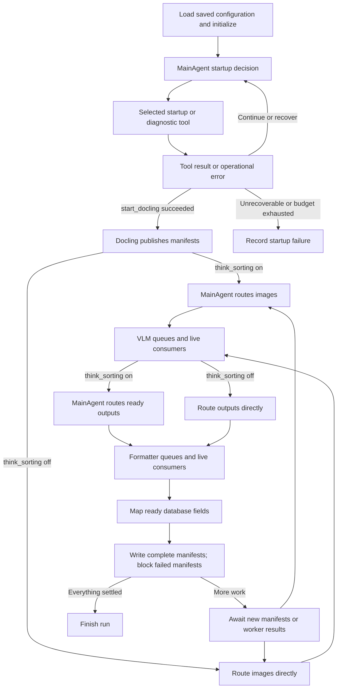

# MainAgent pipeline

The Studio graph is defined in [src/agent/graph.py](src/agent/graph.py).
Its exported topology is [architecture/main_agent_graph.mmd](architecture/main_agent_graph.mmd).

`batch_processing=True` is enabled for the local RAM-limited setup. The same
graph uses [BatchRuntime](src/agent/batch_runtime.py) to make stage nodes wait
for a whole bounded batch. Docling runs in a separate process and exits first;
MainAgent routes images if needed, VLMs run one at a time, MainAgent routes
outputs if needed, and formatters run one at a time. Each model is unloaded
before the next turn. The writer retains per-document atomic transactions.
See [batch configuration](configuration/README.md#low-memory-batch-processing)
for lifecycle requirements, memory limits, and recovery behavior. This new mode
has not been exercised while tests and live inference remain paused.

The diagram and continuous-processing details below describe streaming mode
(`batch_processing=False`); in batch mode its arrows are stage barriers.



Both MainAgent nodes use the **same configured model and the same routing lock**.
`think_sorting=True` enables both decisions; false uses both configured maps.
A stage with one available model routes directly. There are no independent
VLM/formatter thinking switches. Legacy snapshots with those flags are read
with thinking enabled if either old flag was true; start a new run for this topology.

## First-use setup

The coding assistant follows [configuration/README.md](configuration/README.md)
only when `SETUP_COMPLETED=False` or `RERUN_SETUP=True` in `src/config.py`.
After saving the agreed configuration and schema, it marks setup complete and
clears the rerun flag. The current checkout already has agreed choices.
The CLI checks these flags before creating a new run. Neither the CLI nor
Studio conducts the setup interview. Existing runs use saved snapshots.
User-editable switches and policies live in `configuration/run.toml`; model
definitions, routing and hardware settings live in `configuration/models.toml`.
The CLI calls `load_config()` only for new runs. `--config PATH` selects a profile
and cannot be combined with `--run-id`. Loading a saved run does not read TOML.

## Startup and model choices

Startup loads the saved configuration/schema, reads current hardware and builds
the MainAgent context. This bootstrap must precede inference. From that point,
MainAgent selects every startup operation through a native tool call:
`ensure_redis`, `set_vlm_routes`, `set_formatter_routes`, queue creation,
`schedule_models`, and `start_docling`. Prerequisites control tool availability;
independent operations can be selected in either order. The graph checkpoints
the selected call before executing its named tool node.

Operational exceptions become structured tool results. MainAgent can use
`diagnose_redis`, `start_redis_service`, and `inspect_startup_resources`, then
retry the failed operation. Redis diagnostics do not use Redis queues. Service
repair is limited to starting the configured existing stopped Redis container;
credentials, missing containers and unrelated services require outside action.
Startup allows 24 decisions and at most three attempts per tool by default,
including diagnostics. `abort_startup` records the reason without constructing
a Redis-dependent runtime. Downstream image failures keep their existing retry
and storage policies.

`think_sorting` controls image/formatter choices, not startup orchestration.

`show_thinking` independently controls short console action summaries. It reports
startup decisions and results, model routing selections, and batch transitions;
it does not expose internal reasoning or VLM/formatter response text. Messages
are maintained in `src/agent/progress_messages.py` and use the saved run setting.
When it is false, MainAgent still invokes startup tools but route arguments are
fixed to the configured maps. Only explicit `main_agent=None` uses deterministic
startup without an agent. In batch mode, each startup decision uses the model
lifecycle controller and unloads before executing its tool, including Docling
startup. Scheduled model order is honored within each batch stage.

The implementation is separated into [startup orchestration](src/agent/startup_orchestration.py),
[startup tool definitions](src/agent/startup_tools.py), and
[Redis diagnostics and repair](src/agent/redis_recovery.py).

The configured MainAgent alias is `parser-main-agent:latest`, using the installed
`qwen3-abliterated:latest` weights, Ollama base ID
`b07c3bcda724`, Qwen3 8.2B Q4_K_M. This is the installed model the user called
`qwen3.8-abliterated`. Its advertised model context does not itself configure
Ollama's context allocation. `configuration/models/main-agent.Modelfile` sets
16,384 tokens: a live run found that the base alias allocated only 4,096 tokens
and rejected the 6,728-token startup request.

There are three VLMs and three formatters. With thinking enabled, every candidate
has its own stage/model queue; default maps do not restrict per-image choices.
See [additional models](configuration/additional-models.md) for aliases and the
unverified under-4-GB RAM requirement for the two added VLMs.

## Continuous processing and visible stages

[src/agent/stages.py](src/agent/stages.py) contains the graph nodes;
[src/agent/stage_runtime.py](src/agent/stage_runtime.py) owns streaming operations.

1. **start_docling** starts the producer, lease and model consumers.
2. **docling** exposes published manifests immediately. Processing starts with
   the first available manifest; it does not wait for a minimum-sized batch.
3. **main_agent_route_images** schedules an image's VLM choice using its source
   context and top three classifications. **route_images_directly** applies maps.
4. **vlm** publishes routed images to their queues. VLM consumers perform
   inference and retries continuously, and persist each result independently.
5. **main_agent_route_outputs** schedules formatter choices as VLM results arrive.
   **route_outputs_directly** uses the configured VLM-to-formatter map.
6. **formatter** publishes ready outputs to continuously running formatter
   consumers. It never waits for the rest of a document or VLM batch.
7. **map_database_fields** maps each validated result as it becomes available.
8. **write_database** commits each fully ready manifest in one SQL transaction.
   A manifest with an exhausted image failure is blocked; other manifests continue.
9. **await_ready_work** waits for new manifests/results and revisits these stages.
   It does not restart Docling. **finish_run** runs only after the producer and
   all manifests have reached terminal outcomes.

Graph arrows show data dependencies and queue handoffs, not barriers that wait
for every image. Queue nodes return after publishing ready work; actual inference
continues in consumers. Routing nodes allow at most one pending decision per
stage; their shared FIFO lock serializes the MainAgent and prevents a long list
of new image decisions from starving formatter decisions.

Docling buffers at most `manifest_capacity` unfinished manifests (default 50).
`manifest_minimum` is retained for old callers; the streaming graph ignores its
old startup gate. `writer_batch_size` remains available to standalone batch APIs;
the streaming graph always commits ready manifests individually.

## Resources and failure handling

External VLM and formatter consumers remain active independently, bounded by
`requests_per_model`. The endpoint owns actual memory allocation and request
scheduling; available hardware may still serialize inference. Managed models
use validated memory groups and take short turns (one job per queue), rechecking
available memory before launching a group. Only owned processes are stopped.
No per-model 4 GB RAM cap is enforced on external Ollama models.

The retry limit counts additional attempts separately for VLM and formatting.
A formatter retry reuses saved VLM output and receives the previous error.
Saved successful results and model choices survive process replacement.
Routing allows at most three attempts to correct invalid native tool decisions.
Startup operational failures return to MainAgent for bounded recovery;
downstream operational failures remain fatal. Per-image exhausted failures are isolated.

Local chat formatters request schema-constrained JSON using Ollama's
[structured-output support](https://docs.ollama.com/capabilities/structured-outputs).
`formatter_response_format` explicitly selects `json_schema`, `json_object` or
`text` for other endpoints. The parser accepts bare JSON or one enclosing
Markdown fence. It never extracts a guessed substring, repairs invalid JSON,
or invents values. Duplicate keys, nonfinite numbers, truncated responses and
schema violations remain errors. Original model responses are retained.
The NuExtract adapter uses the same safe wrapper handling and existing schema
validation; its schema subset remains documented in [schemas/README.md](schemas/README.md).

With the configured `approve_with_fails=False`, failed manifests receive a
`write_blocked` record, appear in graph errors, and are released from the active
buffer without SQL insertion. Their evidence stays in Redis. The alternate
`omit` policy remains available but is not selected. Successful documents are
stored atomically and replayed writes remain idempotent.

## Running, recovery and verification

Configure services and apply migrations as described in the setup README, then:

```bash
uv run python -m agent /path/to/pdfs
```

`--run-id ID` accepts an approved, unstarted run. For checkpoint recovery use
`build_graph(checkpointer=...)`, a stable `configurable.thread_id`, synchronous
durability and sufficient `recursion_limit`; resume the same checkpoint with
`ainvoke(None, config)`. The CLI has no durable checkpointer by default.
Stop the old runtime before recovery in another process. Redis persistence and
checkpoints are both needed for host-failure recovery.

**Start a new run/thread for this topology and configuration change.** Old graph
checkpoints are not migrated. Legacy event/runtime helpers remain for old callers;
the active graph has no generic coordinator or action-dispatch node.

Tests and inference runs remain paused at the user's request. Static inspection
and graph export do not establish runtime correctness, throughput or peak RAM.
